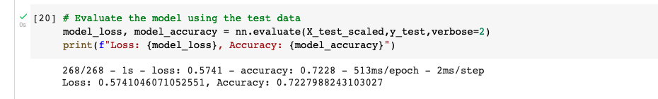

# Neural_Network_Charity_Analysis

## Results: 

From our dataset charity_data.csv, we focus on the column "Is-Successful" that contains the money used effectively.

while working on the optimized model we work with four layers, with 20,50, 80, and 100 neurons 

we tried to get a  model to reach the target of 75%, but it was not possible, the accuracy was 72%.

